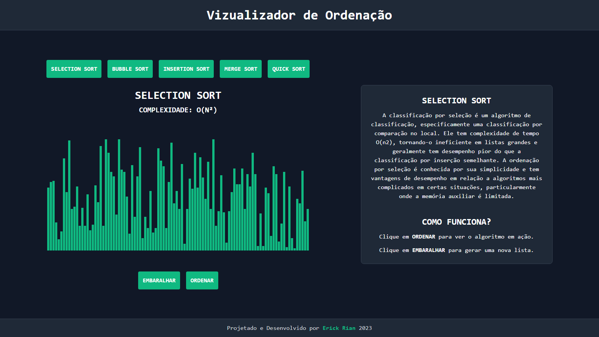

# Sorting Algorithms Visualizer

> Visualizador de algoritmos de ordenação.

## Tecnologias

- [React](https://reactjs.org/)
- [HTML](https://developer.mozilla.org/pt-BR/docs/Web/HTML)
- [TailwindCSS](https://tailwindcss.com/)

## Demonstração

- [Sorting Algorithms Visualizer](https://sorting-algorithm-visualizer-nine.vercel.app/)



## Introdução

Para fins de desenvolvimento e teste, siga às instruções abaixo.

O projeto pode ser construído com **npm** ou **yarn**. Caso não tenha nenhuma instalada, escolha uma das opções abaixo.

- **NPM** (Node Package Manager) é um gerenciador de pacotes de código aberto para JavaScript que faz parte do ecossistema do Node.js. [Download Node.js](https://nodejs.org/en)

- **Yarn** é um gerenciador de pacotes de código aberto para JavaScript criado pelo Facebook e parece ser mais rápido que o npm em geral. [Download Yarn](https://yarnpkg.com/getting-started/install)

## Descrição

O projeto foi desenvolvido com o intuito de visualizar os algoritmos de ordenação mais conhecidos, como: Selection Sort, Bubble Sort, Insertion Sort, Merge Sort e Quick Sort.

## Como instalar

- Para baixar o projeto, siga as instruções abaixo.

```
1. git clone https://github.com/erxck/sorting-algorithm-visualizer.git
2. cd sorting-algorithm-visualizer
```

- Instale as dependências e inicie a aplicação.

```
4. npm install
5. npm run dev
```

ou

```
4. yarn install
5. yarn start
```

## Manter contato

**Erick Nunes**

- [contatoerickrian@gmail.com](mailto:contatoerickrian@gmail.com)
- [github.com/erxck](https://github.com/erxck)
- [linkedin.com/in/erick-rian](https://linkedin.com/in/erick-rian)

E é isso! 😃💻
